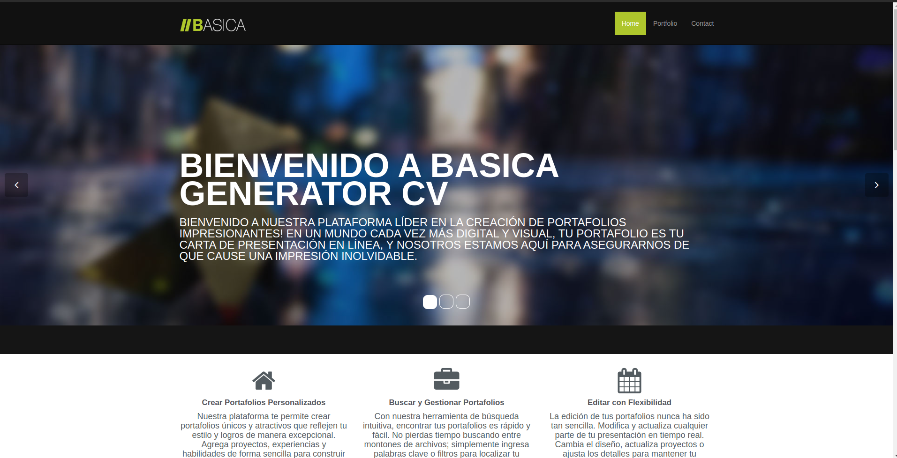

# Basic GeneratoR CV

BasicGeneratoR CV es una aplicación web que te permite crear fácilmente tu propio currículum vitae en línea. Con una interfaz intuitiva y personalizable, podrás destacar tus habilidades y experiencia de manera efectiva.

## Características

- Crea portafolios personalizados.
- Busca y gestiona tus portafolios de manera eficiente.
- Edita con flexibilidad para mantener tu presentación actualizada.
- Facilidad de uso, no se requieren conocimientos avanzados de diseño.

## Navegadores Compatibles

La aplicación web es compatible con los siguientes navegadores:

- Mozilla Firefox

- Google Chrome

## Tecnologías Utilizadas

En la creación de este proyecto, se han empleado diversas tecnologías que se han fusionado para su desarrollo. A continuación, se detallan las tecnologías clave utilizadas:

1. **HTML (Lenguaje de Marcado de Hipertexto):** HTML es el estándar para la creación de páginas web, proporcionando la estructura esencial para presentar el contenido.

2. **CSS (Hojas de Estilo en Cascada):** CSS se utiliza para dar estilo y diseño a la interfaz de usuario de la aplicación web, controlando la presentación de los elementos HTML.

3. **Bootstrap:** Bootstrap es un marco de diseño de código abierto que facilita la creación de interfaces de usuario atractivas y responsivas, al ofrecer componentes y estilos predefinidos.

4. **JavaScript:** JavaScript añade interactividad y funcionalidad a la aplicación web, permitiendo acciones en el lado del cliente.

5. **Json-Server:** Json-Server es una herramienta que posibilita la creación de una API REST ficticia, simplificando el desarrollo y la prueba de aplicaciones que requieren comunicación con una API.

Estas tecnologías se han amalgamado de manera efectiva para concebir y materializar el proyecto, brindando los elementos esenciales para crear una aplicación web funcional y atractiva.

Agradecemos su interés en nuestro proyecto y en las tecnologías que hemos empleado para su realización.

## Instalación del Proyecto

Para poner en marcha este proyecto en tu entorno de desarrollo, sigue los siguientes pasos:

## Requisitos Previos

Asegúrate de tener lo siguiente instalado en tu sistema:

- [Visual Studio Code](https://code.visualstudio.com/): Un editor de código fuente altamente personalizable.
- [Node.js](https://nodejs.org/): Un entorno de tiempo de ejecución de JavaScript que incluye npm, el administrador de paquetes de Node. prefeliblemente instale la version LTS

## Configuración de Json-Server

1. Abre Visual Studio Code y navega hasta la carpeta raíz del proyecto.

2. Abre la terminal integrada en Visual Studio Code o utiliza tu terminal preferida.

3. Ejecuta el siguiente comando para instalar Json-Server de forma global (si aún no lo tienes instalado):

   ```bash
   npm install -g json-server

4. Ahora, Ejecuta el siguiente comando para instalar y actualizar dependencias en proyectos Javascript o NodeJS

    ```bash
     npm i   

6. Ahora, puedes iniciar Json-Server ejecutando el siguiente comando en la terminal:
   ```bash
   npm run dev
   
son-Server se ejecutará en `http://127.0.0.1:5010` de manera predeterminada.

Json-Server ahora proporciona una API REST simulada basada en tu archivo db.json. Puedes acceder a los recursos y datos a través de las rutas proporcionadas.

## Uso

1. Inicia el archivo `index.html`con Live Server
2. Comienza a crear tu currículum en el formulario y completando la información correspondiente.
3. En el navegador en el apartado de `PORTAFOLIO` podras visualizar los portafolios ya echos por los usuarios
4. en `PORTAFOLIO` tambien podras ver los botones de `Eliminar` y `Editar` dando click al respectivo boton hara su funcionalidad

5. cuando uses el boton `Eliminar` se eliminara de la base de datos el CV donde estaba ese boton

6. cuando uses el boton `Editar` se abrira un formulario en un modal en el cual se cargaran los datos ya existentes del CV del usuario. ahi podras cambiar los datos a tu antojo y como veas necesario 

## Capturas de Pantalla

### Pagina Principal


### Formulario Principal


### Portafolios


### visualizacion de CV's


### Apartado de Contacto


### Visualizacion de formulario para editar CV


## Contribución

Agradecemos contribuciones a nuestro proyecto. Si deseas contribuir, sigue estos pasos:

1. Crea un fork del repositorio.
2. Clona tu fork: `git clone https://github.com/tuusuario/tuproyecto.git
3. Crea una rama para tu nueva característica: `git checkout -b nueva-caracteristica`
4. Haz tus cambios y realiza commits: `git commit -m "Agrega nueva característica"`
5. Sube tus cambios a tu fork: `git push origin nueva-caracteristica`
6. Crea un pull request en el repositorio principal.

# Creador del Proyecto

**Nombre del Creador**: [David Andres Santos Mosquera]

**GitHub**: [DavidSantos004](https://github.com/DavidSantos004?tab=repositories) 


## Contacto

Si tienes alguna pregunta o sugerencia, no dudes en contactarnos en [BasicGeneratorCV@gmail.com].

¡Gracias por usar GeneratoR CV!
